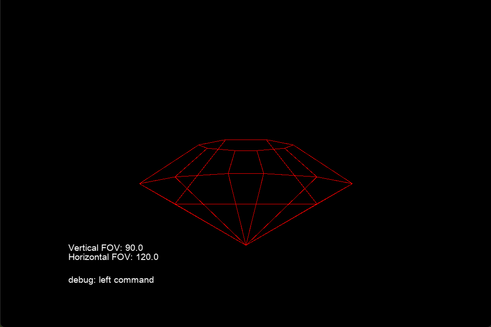
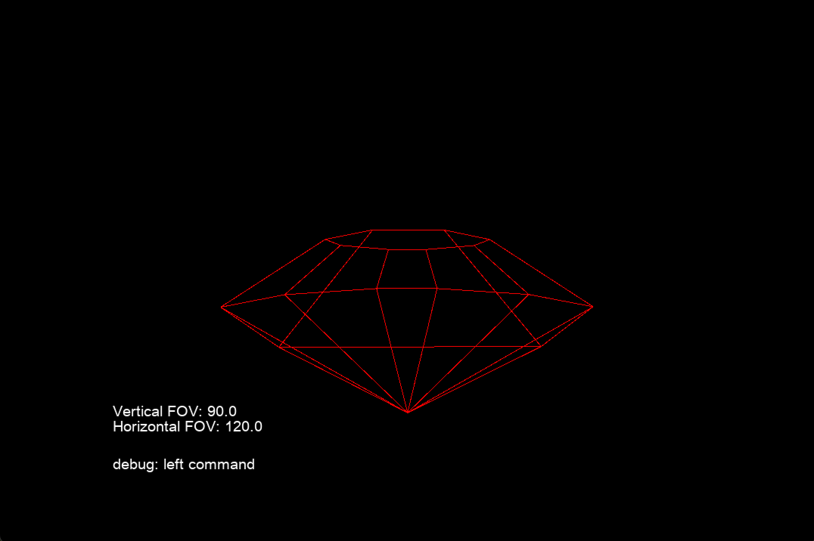
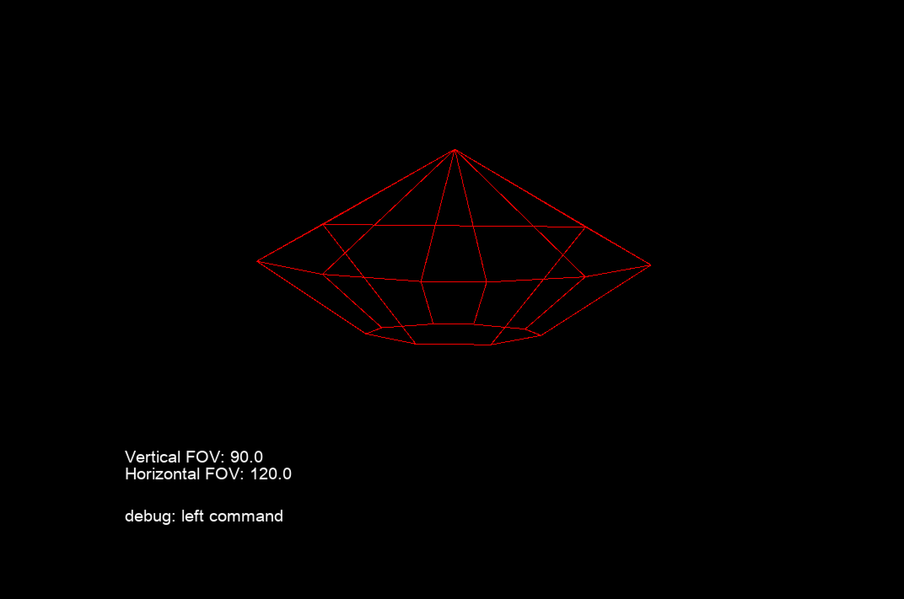
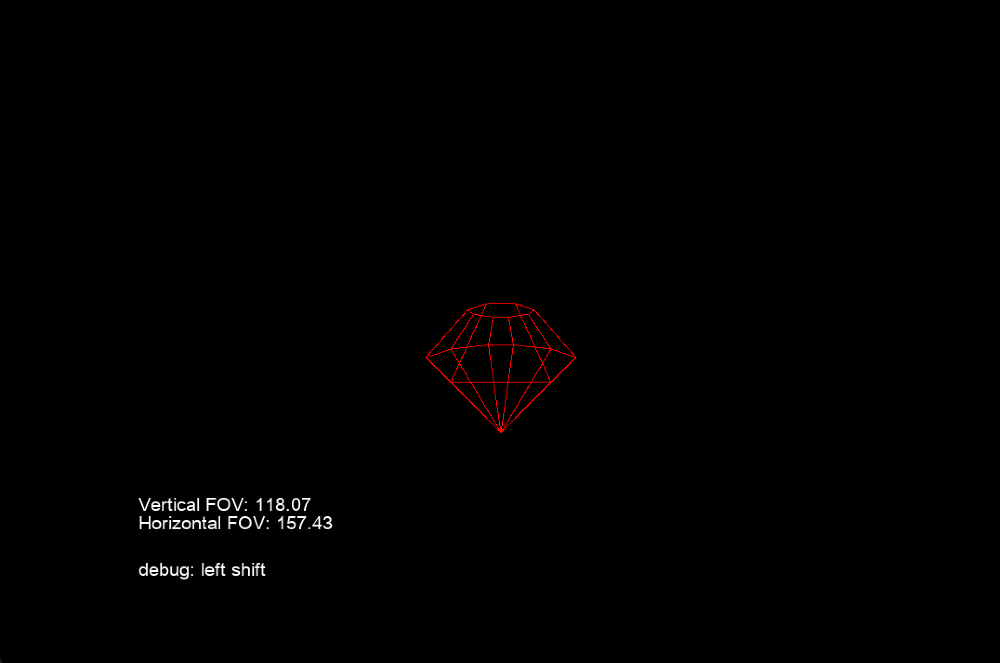
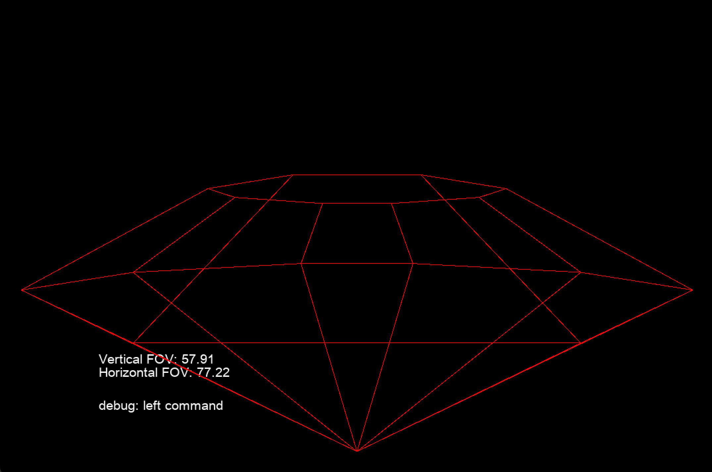

# Zadanie 1

# Bernard Cesarz 313 534

## Sprawozdanie z programu graficznego

### Zagadnienie

Moim celem było stworzenie prostego środowiska graficznego, które umożliwia manipulację wirtualną kamerą do obserwowania obiektów trójwymiarowych rysowanych w przestrzeni dwuwymiarowej.

### Realizacja

W celu zrealizowania tego zadania, najpierw musiałem zrozumieć podstawowe koncepcje związane z transformacjami graficznymi. Wykorzystałem matematyczne operacje przekształceń afinicznych, takie jak translacja i rotacja, aby manipulować światem w celu symulowania ruchu kamery w przestrzeni trójwymiarowej. Utworzyłem wirtualną scenę zawierającą punkty i połączenia między nimi, reprezentujące obiekt w trójwymiarowej przestrzeni. Następnie wykorzystałem macierze transformacji do przemieszczania oraz obracania obiektów względem kamery.

Zastosowałem trójwymiarowy lewoskrętny układ współrzędnych. Aby zadanie było łatwe przyjąłem, że kamera zawsze znajduje się w punkcie (0, 0, 0), a w celu symulowania zmiany jej rotacji i pozycji, obracam i przemieszczam względem niej całą scenę.

### Krótki opis używanych funkcji programu

Funkcja `project_point(point)`:
Ta funkcja odpowiada za rzutowanie punktu z przestrzeni 3D na płaszczyznę rzutni.
Wzór użyty do obliczenia współrzędnych rzutowania jest oparty na proporcji geometrycznej między odległością punktu od kamery a jego współrzędnymi na ekranie.
Współrzędne rzutowania punktu są zwracane jako macierz kolumnowa.

Funkcja `rotation_matrix(axis_vector, angle)`:
Tworzy macierz rotacji dla danego wektora osi i kąta obrotu.
Wykorzystuje podane parametry do obliczenia wartości w macierzy rotacji.

Funkcja `rotate_point_for_camera(point)`:
Obraca punkty względem kamery.
Wykorzystuje aktualną macierz transformacji kamery do obracania punktów. Po jej użyciu na wszystkich punktach w scenie, można stwierdzić, że scena przesunęła się w przeciwnym kierunku do ruchu,
który miałaby wykonać kamera (gdyby to świat był nieruchomy, a kamera ruchoma), co symuluje przemieszczenie bądź obrócenie kamery.

Funkcja `translate_matrix(x, y, z)`:
Tworzy macierz translacji dla zadanych wartości wzdłuż osi x, y, z.
Macierz ta służy do przesuwania punktów w przestrzeni.

#### Funkcje do przygotowania obiektu w scenie

Funkcja `translate_point(point, translation_vector)`:
Ta funkcja służy do przesuwania punktu o zadany wektor translacji.
Dodaje wektor translacji do współrzędnych punktu, aby uzyskać nową pozycję.

Funkcja `rotate_point(point, rotation_axis, angle)`:
Obraca punkt wokół zadanej osi o określony kąt.
Wykorzystuje wcześniej zdefiniowaną funkcję rotation_matrix, aby uzyskać macierz rotacji, a następnie przekształca punkt zgodnie z tą macierzą.

### Istotne punkty

Najważniejszym aspektem realizacji było zrozumienie zastosowania macierzy transformacji do manipulacji obiektami, tak żeby ich przemieszczenie i rotacja były równoważne temu co działoby się przy faktycznym wpływaniu na położenie i obrót kamery.
Macierz transformacji jest na bieżąco aktualizowana, po otrzymaniu informacji od użytkownika.
Układ współrzędnych kamery zdefniowałem jako lewoskrętny, gdzie oś OY jest pionowa i biegnąca z dołu do góry,
oś OX jest pozioma i biegnąca z lewej do prawej, a oś OZ jest pozioma i biegnąca od obserwatora do ekranu.

#### Widok od frontu

#### Widok od tyłu (po obróceniu o kąt 180 stopni w osi y i przemieszczeniu się na tę samą odległość od odpowiadającej krawędzi po drugiej stronie)

#### Widok po obróceniu o 180 stopni w osi Z

#### Zwiększenie kąta FOV

#### Zmniejszenie kąta FOV

### Obsługa programu

< W > przemieszczenie do przodu

< S > przemieszczenie do tyłu

< A > przemieszczenie w lewo

< D > przemieszczenie w prawo

< Z > przemieszczenie w górę

< X > przemieszczenie w dół

< R > zresetowanie połozenia kamery, do pozycji początkowej

< + > zwiększenie wartości FOV

< - > zmniejszenie wartości FOV

< ← > obrót w lewo wokół osi y (spojrzenie w lewo)

< → > obrót w prawo wokół osi y (spojrzenie w prawo)

< ↑ > obrót w lewo wokół osi x (spojrzenie w dół)

< ↓ > obrót w prawo wokół osi x (spojrzenie w górę)

< [ > obrót w lewo wokół osi z (obrócenie kamery w lewo)

< ] > obrót w prawo wokół osi z (obrócenie kamery w prawo)

### Testy

Aby przetestować działanie programu, przeprowadziłem interakcję użytkownika poprzez przemieszczanie kamery oraz obracanie jej za pomocą klawiatury. Program reaguje na naciśnięcia klawiszy, co umożliwia symulację różnych scenariuszy związanych z manipulacją trójwymiarową sceną, przedmioty charakteryzują się poprawnym wyglądem perspektywicznym. Porównałem jeszcze wygląd obiektu po wykonaniu operacji, które powinny dać podobnie wyglądający rezultat.

### Podsumowanie

Testy potwierdziły poprawne działanie programu. Możliwość przemieszczania kamery i obracania działa zgodnie z założeniami. Program umożliwia płynną interakcję z wirtualną przestrzenią trójwymiarową, co potwierdza jego funkcjonalność.

---

**Technologia:** Program został napisany w języku Ruby, wykorzystałem bibliotekii Ruby2D oraz Matrix, aby nie musieć od zera implementować mechanizmów podstawowych operacji na macierzach i obsługi rysowania linii na ekranie komputera.
